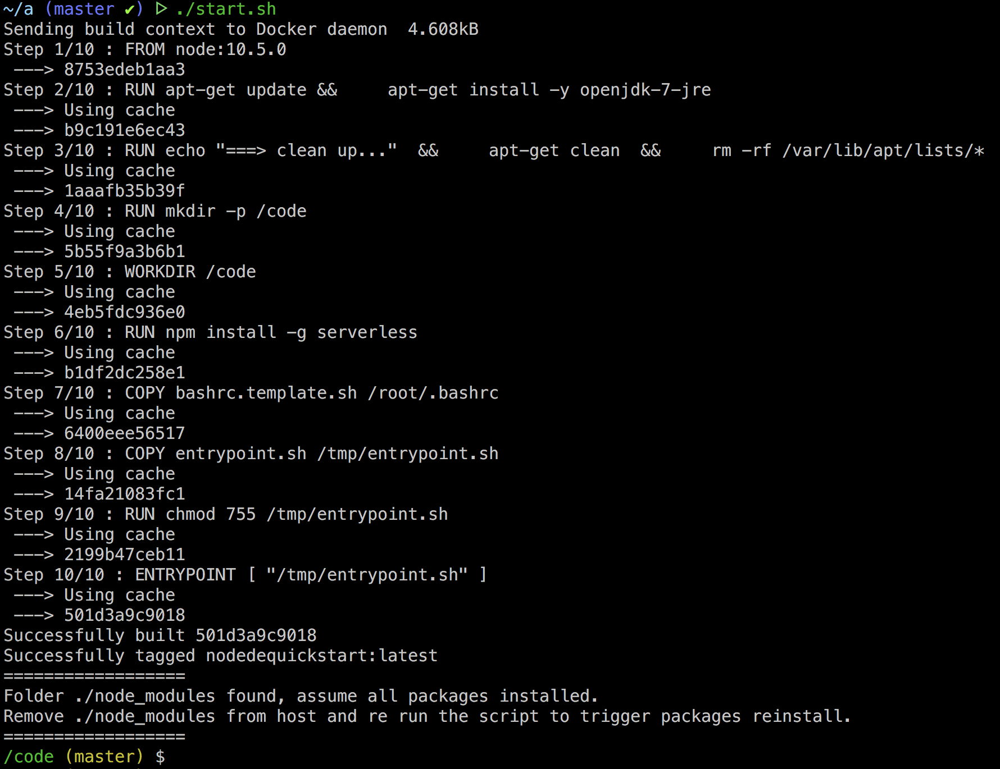
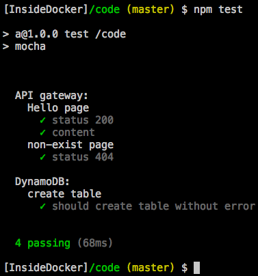

# Node development quick start
This repo is for Nodejs develpers quick start AWS lambda developement work .

Developer can quickly start work in his local laptop without AWS account or connection by few commands in few minutes. 

The code developered under this images will work seemless when deployed to AWS.

## What packages included:
1. node
2. npm
3. serverless framework
4. serverless-dynamodb-local 
5. serverless-dynamodb-client 
6. serverless-offline
7. dynamodb

## Limitations
- Only Nodejs development supported. Java is not supported since not supported by serverless framework

## Todo
- Test on windows. All tests are done in Mac enviroment
- Test proxy. All tests are done under the enviroment without proxy

## Benifit to run the enviroment using docker
- quick start, just run few commands
- OS independent, it can run on Windows, Linux or Mac
- Consistance configure accross all developers
- Consistance configure accross all enviroments, developement, SIT or even prod
- Easy for CI/CD deployment

## Pre-requirements
- docker (to run the enviroment)
- visual studio code (recommded JavaScript IDE)

## Getting start
1. Download the code
2. run commands (Mac/Linux)
    ```bash
    ./start.sh
    ```
3. Link to your code repo

    ```bash
    ## git
    echo "# nodeDevQuickStart" >> README.md
    git init
    git add README.md
    git commit -m "first commit"
    git remote add origin [Your repo link]
    git push -u origin master
    ```

## How to use

The API URL is http://localhost:3000. When making code change in the working directory, simplely refres the browser to get the new code run.

All API call log stored in: /var/log/serverless.log

Dynamodb console can be access: http://localhost:8000/shell.

1. Git clone your team code repo (initialled from getting start)
2. run commands
    ```bash
    ./start.sh
    ```
3. start coding

# Note
- Run npm command insde the docker but not from host machine. All packages should be installed by run npm command inside the docker to avoid conflict

# Screen shot
- start

    

- npm test

    

# Reference
- [serverless](https://serverless.com/)
- [serverless offline](https://www.npmjs.com/package/serverless-offline)
- [serverless dynamodb local](https://www.npmjs.com/package/serverless-dynamodb-local)


